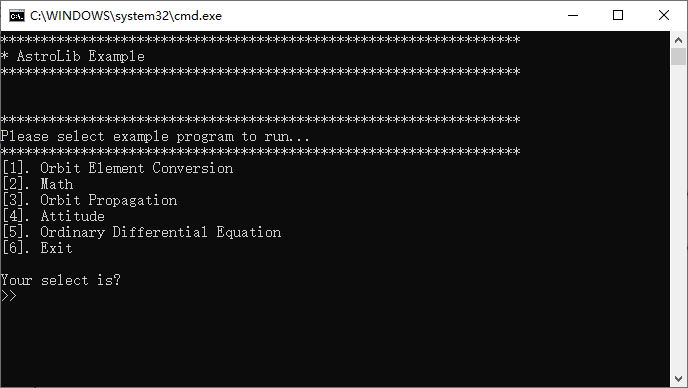
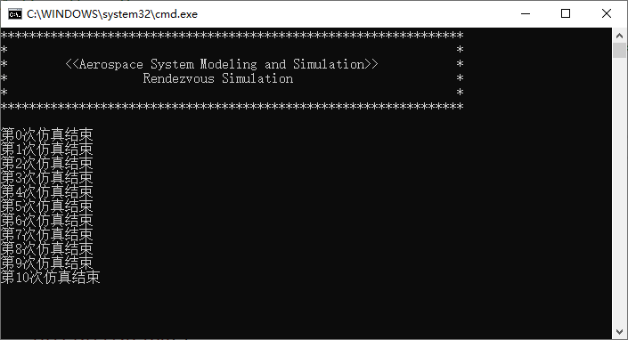
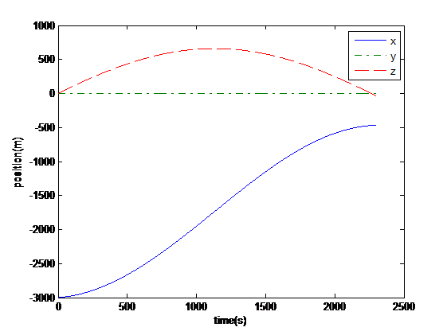
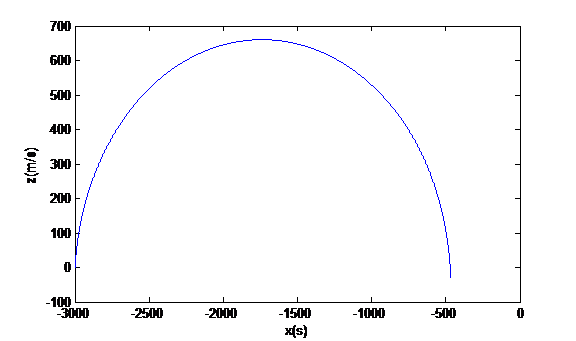
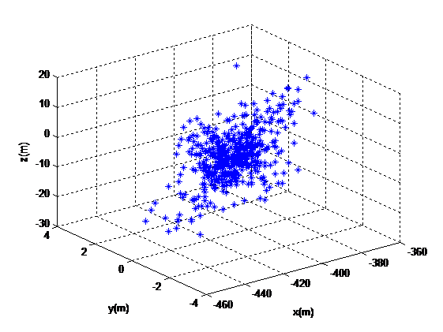

# 航天仿真库AstroLib

#### 介绍
航天仿真库AstroLib
该程序包是《航天系统仿真与推演》的一个教学程序

1. AstroLib目录
提供了矢量、矩阵、姿态、轨道、插值、积分算法等航天仿真需要的基本程序。
AstroLib是其他工程的基础，使用时需要将AstroLib.h文件和Include、Lib目录拷贝到其他Project项目目录下。
注意，这是一个静态库，不能运行，不能运行，不能运行！

2. Example录
AstroLib使用例子，包括轨道参数转换，数学，轨道外推，姿态等。
可执行程序，依赖AstroLib静态库。

2. SimDoF6目录
Chapter 5 飞行器六自由度仿真实例。
可执行程序，依赖AstroLib静态库。

3. Rendezvous目录
Chapter 9 交会对接接近段仿真实例。
可执行程序，依赖AstroLib静态库。

#### 软件架构

软件实现了航天仿真核心模型算法，包括：
1.  矢量和矩阵;
2.  数值算法, 包括数学基本运算,随机数生成,插值,常微分方程初值问题求解等;
3.  时间系统和坐标系统;
4.  姿态参数, 姿态参数转换;
5.  轨道参数, 轨道参数转换;
6.  姿态动力学;
7.  轨道动力学;
8.  空间环境;
9.  飞行器六自由度仿真实例;
10. 交会对接接近段仿真实例.

#### 安装教程

项目使用说明：
1. 用VS2015直接打开。

#### 使用说明

AstroLib使用说明：
1. 将AstroLib.h文件和Include、Lib目录拷贝到自己的项目目录下;
2. 在需要用到库中函数的文件中包含"AstroLib.h"文件即可.

#### 参与贡献

1.  王华Fork 本仓库
2.  新建 Feat_xxx 分支
3.  提交代码
4.  新建 Pull Request

#### 特技

1.  使用 Readme\_XXX.md 来支持不同的语言，例如 Readme\_en.md, Readme\_zh.md
2.  Gitee 官方博客 [blog.gitee.com](https://blog.gitee.com)
3.  你可以 [https://gitee.com/explore](https://gitee.com/explore) 这个地址来了解 Gitee 上的优秀开源项目
4.  [GVP](https://gitee.com/gvp) 全称是 Gitee 最有价值开源项目，是综合评定出的优秀开源项目
5.  Gitee 官方提供的使用手册 [https://gitee.com/help](https://gitee.com/help)
6.  Gitee 封面人物是一档用来展示 Gitee 会员风采的栏目 [https://gitee.com/gitee-stars/](https://gitee.com/gitee-stars/)
